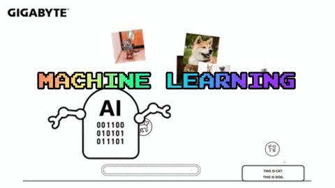
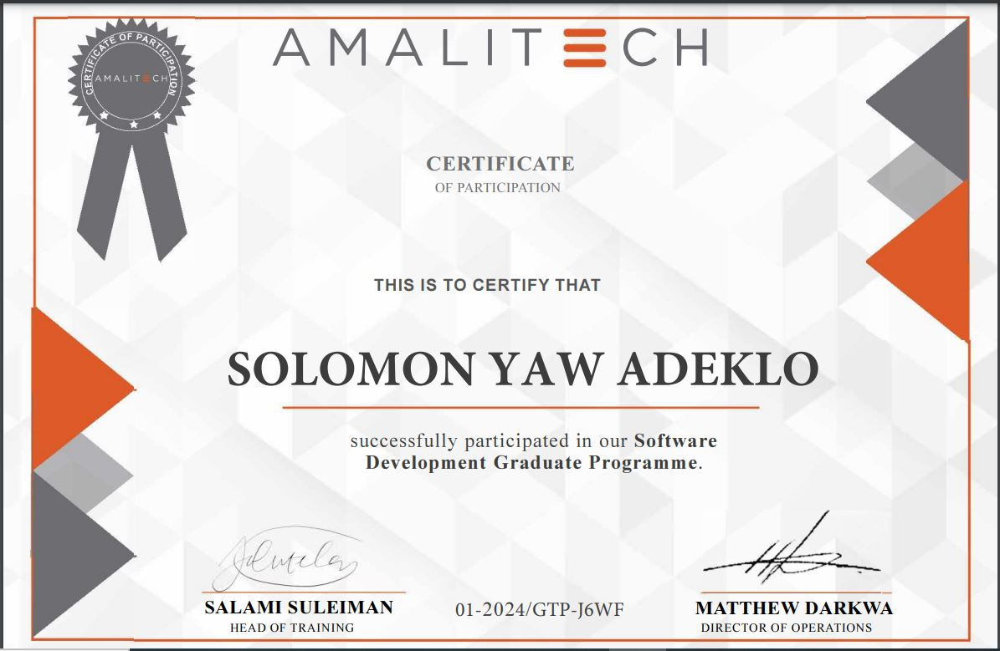

<h1 align="center">Hello 👋, I'm Solomon Yaw Adeklo Dordor</h1>
<h3 align="center">I am an aspiring Data Science and Machine Learning Engineer. I also see myself as an anticipatory Design Science enthiusiast since I want to solve global problems with innovating artifacts(software). I want to solve global problems with Data Science and Machine Learning. I see myself in a few years being a member of the Buckminster Fuller Institute solving problems with Design Science specifically leveraging tools in Data Science and Machine Learning  💻📉📊 😀✨</h3>

  

  

 

  

- 🔭 I’m currently working on **A customer conversion system using Machine Learning**

- 🌱 I’m currently learning **Python and Pandas**

- 👨‍💻 My website: [https://solomonyaw.github.io/](https://solomonadeklo.github.io/)

- 💬 Ask me about **Machine Learning**

- ⚡ Fun fact **I'm jovial**

- 📫 How to reach me **sadeklo@st.vvu.edu.gh**
- 📄 Know about my experiences   https://solomonyaw.github.io/CV.pdf 
- 📹 Check out my youtube channel https://www.youtube.com/@trinarycompanylimited
   

🌐 Languages : English, Twi(Native Ghanaian Language), Ewe(Native Ghanaian Language).

 
          
     
 
     
 
 

 
<h3 align="left"><ins>Software Engineering Apprenticeship (Graduate Trainee Programme)</ins></h3>
 

  
 
   I completed my Graduate Trainee Program in Software Engineering at AmaliTech Training Academy. It was a software engineering apprenticeship program organized my Amaltech gGmbH.
 Below is my awarded certificate.

<h3 align="left"><ins>Final Year Undergraduate Project</ins></h3>

I studied a Bsc. in Information Technology at Valley View University. My Final Year Project involved a research work to develop a social protection management information system to register potential members online to make contributions 
  into social security schemes and to provide social assistance to beneficiaries of the scheme via a secure web portal. This thesis was based on a case study into how the social security system works in a developing country such as Ghana.
  Click here to read my full project documentation => <a href="https://www.researchgate.net/publication/368662756_A_SOCIAL_PROTECTION_MANAGEMENT_INFORMATION_SYSTEM_CASE_STUDY_INTO_SOCIAL_SECURITY_AND_NATIONAL_INSURANCE_TRUST"> Final Year Project </a> 
  

<h3 align="left">Connect with me:</h3>

 
        

<h3 align="left">Languages and Tools:</h3>

        

&nbsp;

