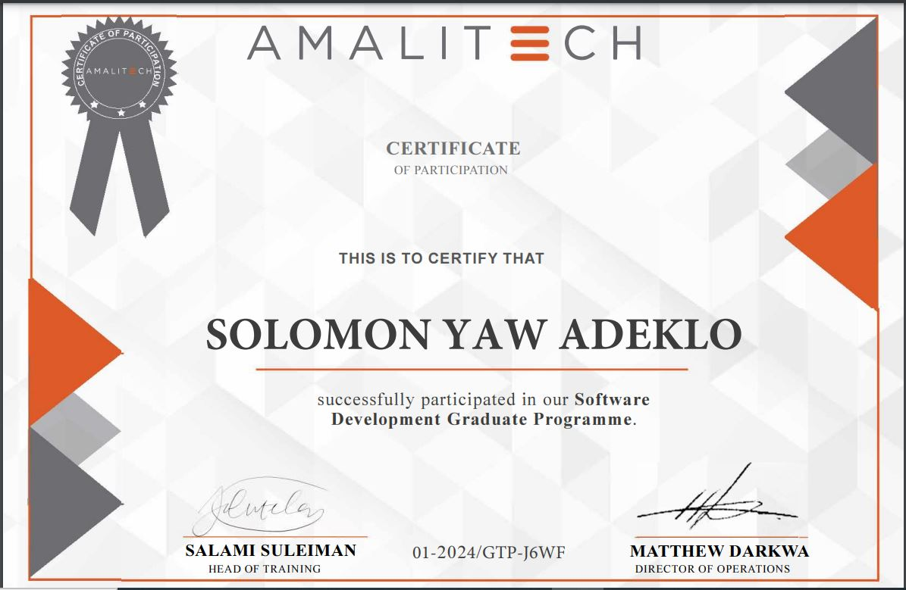

<h1 align="center">Hello 👋, I'm Solomon Yaw Adeklo</h1>

<h3 align="center">👋 Solomon Yaw Adeklo is the Co-Founder and Chief Information Officer (CIO) of Handbill, where he leads the company’s technology vision, product architecture, and digital innovation. With a background in Information Technology, Solomon focuses on building scalable platforms that drive economic growth and empower local businesses in Ghana and Africa.</h3> Project website: <a href="https://www.handbillapp.com">https://www.handbillapp.com</a>

# Synergetics Operating System (SOS)

I am also the founder of this open source project (Synergetics Operating System).

🌐 Website: https://solomonyaw.github.io/Synergetic-Operating-System/  
📁 GitHub Repository: https://github.com/solomonyaw/Synergetics-Operating-System
<h2>🎵 Yahweh Music</h2>

I am the creator of <a href="https://www.yahwehmusic.online" target="_blank"><strong>Yahweh Music</strong></a> (https://www.yahwehmusic.online), 
a gospel music platform dedicated to spreading the unadulterated Word of God through music powered by Artificial Intelligence.

Inspired and instructed by God, I use AI as a creative tool to produce spiritually uplifting music that glorifies God 
and reaches people beyond traditional boundaries.

  

# Solomon Ghandi

I am the Founder of <b>Solomon Ghandi</b>, an AI-powered hip-hop artist creating conscious hip-hop music using AI — https://solomonghandi.online/
 

 Project repo: [https://github.com/solomonyaw/SolomonGhandi](https://github.com/solomonyaw/SolomonGhandi)

 # Panafricoin

I am the Co-Founder of <b>Panafricoin.</b>
PanAfricoin (PAC) is a blockchain-powered middleware that connects cryptocurrencies with mobile money and banking systems across Africa. It enables seamless conversion, transfer, and settlement of value between digital assets and local currencies, acting as a unified financial bridge for real-world transactions.
 

 Prototype website: [https://panafrica-coin--adeklosolomon.replit.app/](https://panafrica-coin--adeklosolomon.replit.app/about)
 Project repo: [https://github.com/solomonyaw/SolomonGhandi](https://github.com/solomonyaw/-PanAfricoin)

# 🚀 My Portfolio Website

I’ve redesigned my portfolio to go beyond the traditional “skills and projects” format.

Instead of just showcasing what I know, this portfolio tells the **story behind my growth** — the experiences, challenges, and personal development journey that shaped me as a developer.

🌐 Live Site: https://solomonadeklo.com/

# My Dad's memorial & biography website (Samuel Yao Adeklo)

  This project is a beautifully designed <strong>In Loving Memory &amp; Biography Website</strong> dedicated to Samuel Yao Adeklo, preserving his life, legacy, and impact through digital storytelling.

  🌐 <strong>Live Website:</strong> 
  <a href="https://samueladeklo.created.app/" target="_blank">
    https://samueladeklo.created.app/
  </a>
 💻 <strong>GitHub Repo:</strong> 
  <a href="https://github.com/solomonyaw/-SamuelYaoAdeklo" target="_blank">
    https://github.com/solomonyaw/-SamuelYaoAdeklo
  </a>

# John Tutu Adeklo Memorial Website (My grandfather)

A digital memorial website created in honor of my late grandfather **John Tutu Adeklo (Dordor)**, a respected hunter and the first Presbyter of the E.P Church in Hlefi.

Website: http://www.solomonadeklo.com/JohnAdeklo/

# Hlefi Village Website (My Hometown and village)

Hlefi is a peaceful farming community located in the Ho West District of Ghana’s Volta Region, surrounded by the beautiful Akwapim–Togo mountain ranges and known for its rich Ewe culture, agriculture, and communal spirit.

🌍 Website: http://www.solomonadeklo.com/Hlefi/

  

 

  

  | 

- 🔭 I’m currently working on **A mobile advertising app called Handbill**

- 👨‍💻 My Project website: [http://www.handbillapp.com/](http://www.handbillapp.com/)

- 💬 Ask me about **Mobile Advertising**

- ⚡ Fun fact **I'm jovial**

- 📫 How to reach me **sadeklo@st.vvu.edu.gh**
- 📄 Know about my experiences   https://solomonyaw.github.io/CV.pdf    

🌐 Languages : English, Twi (Native Ghanaian Language), Ewe (Native Ghanaian Language).

## Books Written By Solomon Yaw Adeklo
📘 **Book 1 :** [How to Modernize the Football and Sports Industry in Africa Using Buckminster Fuller’s Ideas](https://github.com/solomonyaw/How-to-Modernize-the-Football-and-Sports-Industry-in-Africa-Ghana-Using-Buckminster-Fuller-s-Ideas/blob/main/How%20to%20Modernize%20the%20Football%20and%20Sports%20Industry%20in%20Africa%20Using%20Buckminster%20Fuller%E2%80%99s%20Ideas%20(Autosaved).pdf) 
**Repository** ==> [How to Modernize the Football and Sports Industry in Africa Using Buckminster Fuller’s Ideas](https://github.com/solomonyaw/How-to-Modernize-the-Football-and-Sports-Industry-in-Africa-Ghana-Using-Buckminster-Fuller-s-Ideas)  

📗 **Book 2:** [The Wealth of Laodicea – Rich Yet Spiritually Bankrupt](https://github.com/solomonyaw/YahwehMusic/blob/main/The%20Wealth%20of%20Laodicea%20-%20Rich%20Yet%20Spiritually%20Bankrupt.pdf)  

📗 **Book 3:** [The Original Blueprint - God’s Divine Plan for Marriage, Dominion, and Redemption](https://github.com/solomonyaw/YahwehMusic/blob/main/The%20Original%20Blueprint%20-%20God%E2%80%99s%20Divine%20Plan%20for%20Marriage%2C%20Dominion%2C%20and%20Redemption.pdf
)  

📘 **Book 4 (Excerpts):** [A Better Africa: Using Buckminster Fuller’s Ideas to Solve Today’s African Problems](https://github.com/solomonyaw/A-Better-Africa-Using-Buckminster-Fuller-s-Ideas-to-Solve-Today-s-African-Problems/blob/main/A%20Better%20Africa%20Using%20Buckminster%20Fuller%E2%80%99s%20Ideas%20to%20Solve%20Today%E2%80%99s%20African%20Problems.pdf) 
**Repository** ==> [A Better Africa: Using Buckminster Fuller’s Ideas to Solve Today’s African Problems](https://github.com/solomonyaw/A-Better-Africa-Using-Buckminster-Fuller-s-Ideas-to-Solve-Today-s-African-Problems)  

📘 **Book 5 :** [Modernizing Ghana’s Film Industry- A Scientific and Technological Blueprint](https://github.com/solomonyaw/Modernizing-Ghana-s-Film-Industry-A-Scientific-and-Technological-Blueprint-/blob/main/Modernizing%20Ghana%E2%80%99s%20Film%20Industry-%20A%20Scientific%20and%20Technological%20Blueprint.pdf)
**Repository** ==> [Modernizing Ghana’s Film Industry- A Scientific and Technological Blueprint](https://github.com/solomonyaw/Modernizing-Ghana-s-Film-Industry-A-Scientific-and-Technological-Blueprint-)

## Read My Personal Testimony

Read My testimony with the link below 👇🏾

[https://solomonyaw.github.io/My-testimony](https://solomonyaw.github.io/My-testimony)

## My NFT Project Repository (RFNFT)

The link to my RFNFT Project repo is below 👇🏾

[https://github.com/solomonyaw/ronyfoster](https://github.com/solomonyaw/ronyfoster)

 
          
     
 
     
 
 

 
<h3 align="left"><ins>Software Engineering Apprenticeship (Graduate Trainee Programme)</ins></h3>
 

  
 
   I completed my Graduate Trainee Program in Software Engineering at AmaliTech Training Academy. It was a software engineering apprenticeship program organized by Amalitech gGmbH.
 Below is my awarded certificate.

 [https://amalitech.com/ghana-training/](https://amalitech.com/ghana-training)
 
 <h3 align="left">Other Certificates acquired while under trainiing in Amalitech</ins></h3>
 
  [Click to see my certificates I acquired at Codecademy while under training at Amalitech](https://www.codecademy.com/users/solomonyaw/achievements)

 
<h3 align="left"><ins>Final Year Undergraduate Project</ins></h3>

I studied a Bsc. in Information Technology at Valley View University. My Final Year Project involved a research work to develop a social protection management information system to register potential members online to make contributions 
  into social security schemes and to provide social assistance to beneficiaries of the scheme via a secure web portal. This thesis was based on a case study into how the social security system works in a developing country such as Ghana.
  Click here to read my full project documentation => <a href="https://www.researchgate.net/publication/368662756_A_SOCIAL_PROTECTION_MANAGEMENT_INFORMATION_SYSTEM_CASE_STUDY_INTO_SOCIAL_SECURITY_AND_NATIONAL_INSURANCE_TRUST"> Final Year Project </a> 
  

<h3 align="left">Connect with me:</h3>

 
        

<h3 align="left">Languages and Tools:</h3>

        

&nbsp;

