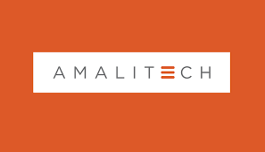

<h1 align="center">Hello 👋, I'm Solomon Yaw Adeklo Dordor</h1>
<h3 align="center">A passionate Front-End developer based in Tema/Ghana. I specialize in Web Development, specifically JavaScript programming . I love to network, join new communities and add value to communities globally✨</h3>

  

  

 

  

- 🔭 I’m currently working on **a social protection management information system**

- 🌱 I’m currently learning **Javascript and Vue.Js**

- 👨‍💻 My website: [https://solomonyaw.github.io/](https://solomonyaw.github.io/)

- 💬 Ask me about **MEARN**

- ⚡ Fun fact **I'm jovial**

- 📫 How to reach me **sadeklo@st.vvu.edu.gh**
- 📄 Know about my experiences   https://solomonyaw.github.io/CV.pdf 
- 📹 Check out my youtube channel https://www.youtube.com/@trinarycompanylimited
- 📝 Checkout my Medium profile where I have written a couple of articles that share my viewpoint about how I percieve the world.
  Click here to read my articles 👉 https://sadeklo.medium.com/
   

🌐 Languages : English, Twi(Native Ghanaian Language), Ewe(Native Ghanaian Language).

Download My most favourite muscic below
 
<a href="https://www.up-4ever.net/p589fa1v8iob" target=_blank>yt1s.com - Lupe Fiasco  Dopamine Lit Intro.mp3 - 2.6 MB</a> 

 
          
     
 
     
 
 

 
<h3 align="left"><ins>Front-End Software Engineering Apprenticeship (Graduate Trainee Programme)</ins></h3>
 
  
 
   I completed my Graduate Trainee Program in Front-End Software Engineering at AmaliTech Training Academy. It was a software engineering apprenticeship program organized my Amaltech gGmbH.
 Below is my awarded certificate.
   

   

<h3 align="left"><ins>Final Year Undergraduate Project</ins></h3>

I studied a Bsc. in Information Technology at Valley View University. My Final Year Project involved a research work to develop a social protection management information system to register potential members online to make contributions 
  into social security schemes and to provide social assistance to beneficiaries of the scheme via a secure web portal. This thesis was based on a case study into how the social security system works in a developing country such as Ghana.
  Click here to read my full project documentation => <a href="https://www.researchgate.net/publication/368662756_A_SOCIAL_PROTECTION_MANAGEMENT_INFORMATION_SYSTEM_CASE_STUDY_INTO_SOCIAL_SECURITY_AND_NATIONAL_INSURANCE_TRUST"> Final Year Project </a> 
  

I published a tutorial on youtube on a review of my Final Year Project . I had to do a presentation of all the core features of the system. I disabled the web screen reader feature in order to prevent conflicting sounds when I speak via the microphone.Click on the image below to watch video 👇👉 https://www.youtube.com/watch?v=wgXSkkYlIoA

 

Biography of my project supervisor 👇 👉https://vvu.edu.gh/index.php/lms/teachers/teacher/prince-yaw-owusu-amoako

Below is an introductory video prologue that inspires my goal of me reaching the status of a Full Stack Software Engineer . 👇 📷📸🔥🔥👨‍💻👨‍💻⌨️ 🌍✨

  

<h3 align="left">Connect with me:</h3>

 
        

<h3 align="left">Languages and Tools:</h3>

      </a>      </a> <a href="#">

&nbsp;

